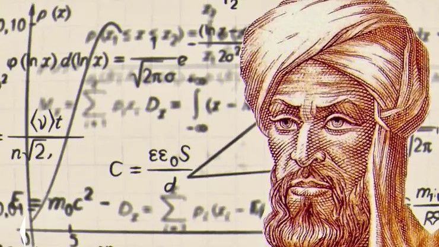

<a href="index">Home</a> -
<a href="laboratorium">Lab</a> -
<a href="about">About</a> -
<a href="legend">The Legend</a> -
<a href="contact">Contact</a>

[Muhammad ibn Musa al-Kwarizmi](#muhammad-ibn-musa-al-khwarizmi)  
[Hezârfen Ahmed Çelebi](#hezârfen-ahmed-çelebi)   

# Muhammad ibn Musa al-Khwarizmi

Al-Khwārizmī (born c. 780 —died c. 850) was a Muslim mathematician and astronomer whose major works introduced Hindu-Arabic numerals and the concepts of algebra into European mathematics. Latinized versions of his name and of his most famous book title live on in the terms algorithm and algebra.

Al-Khwārizmī lived in Baghdad, where he worked at the “House of Wisdom” (Dār al-Ḥikma) under the caliphate of al-Maʾmūn. The House of Wisdom acquired and translated scientific and philosophic treatises, particularly Greek, as well as publishing original research. Al-Khwārizmī’s work on elementary algebra, Al-Kitāb al-mukhtaṣar fī ḥisāb al-jabr waʾl-muqābala (“The Compendious Book on Calculation by Completion and Balancing”), was translated into Latin in the 12th century, from which the title and term algebra derives. Algebra is a compilation of rules, together with demonstrations, for finding solutions of linear and quadratic equations based on intuitive geometric arguments, rather than the abstract notation now associated with the subject. Its systematic, demonstrative approach distinguishes it from earlier treatments of the subject. It also contains sections on calculating areas and volumes of geometric figures and on the use of algebra to solve inheritance problems according to proportions prescribed by Islamic law. Elements within the work can be traced from Babylonian mathematics of the early 2nd millennium bce through Hellenistic, Hebrew, and Hindu treatises.
Equations written on blackboard
Britannica Quiz
Numbers and Mathematics

In the 12th century a second work by al-Khwārizmī introduced Hindu-Arabic numerals (see numerals and numeral systems) and their arithmetic to the West. It is preserved only in a Latin translation, Algoritmi de numero Indorum (“Al-Khwārizmī Concerning the Hindu Art of Reckoning”). From the name of the author, rendered in Latin as Algoritmi, originated the term algorithm.

A third major book was his Kitāb ṣūrat al-arḍ (“The Image of the Earth”; translated as Geography), which presented the coordinates of localities in the known world based, ultimately, on those in the Geography of Ptolemy (flourished 127–145 ce) but with improved values for the length of the Mediterranean Sea and the location of cities in Asia and Africa. He also assisted in the construction of a world map for al-Maʾmūn and participated in a project to determine the circumference of the Earth, which had long been known to be spherical, by measuring the length of a degree of a meridian through the plain of Sinjār in Iraq.

Finally, al-Khwārizmī also compiled a set of astronomical tables (Zīj), based on a variety of Hindu and Greek sources. This work included a table of sines, evidently for a circle of radius 150 units. Like his treatises on algebra and Hindu-Arabic numerals, this astronomical work (or an Andalusian revision thereof) was translated into Latin.

<a href="https://www.britannica.com/biography/al-Khwarizmi">Copied from Britannica</a>

# Hezârfen Ahmed Çelebi

The 17th century writings of Evliyâ Çelebi relate this story of Hezârfen Ahmed Çelebi, circa 1630–1632:

First, he practiced by flying over the pulpit of Okmeydanı eight or nine times with eagle wings, using the force of the wind. Then, as Sultan Murad Khan (Murad IV) was watching from the Sinan Pasha mansion at Sarayburnu, he flew from the very top of the Galata Tower (in contemporary Karaköy) and landed in the Doğancılar Square in Üsküdar, with the help of the south-west wind. Murad Khan then rewarded him for his feat with a sack of gold coins, saying: "This man is uncanny: he is capable of doing anything he wishes. It is not right to surround oneself with such people". True to his word, he then exiled Ahmed to Algeria, where the scientist remained until his death.

— Evliyâ Çelebi

<a href="https://islamansiklopedisi.org.tr/hezarfen-ahmed-celebi">TDV Islam Ansiklopedesi - HEZARFEN AHMED ÇELEBİ</a>  
<a href="https://en.wikipedia.org/wiki/Hez%C3%A2rfen_Ahmed_%C3%87elebi">Copied from Wikipedia - Hezârfen Ahmed Çelebi</a>  
